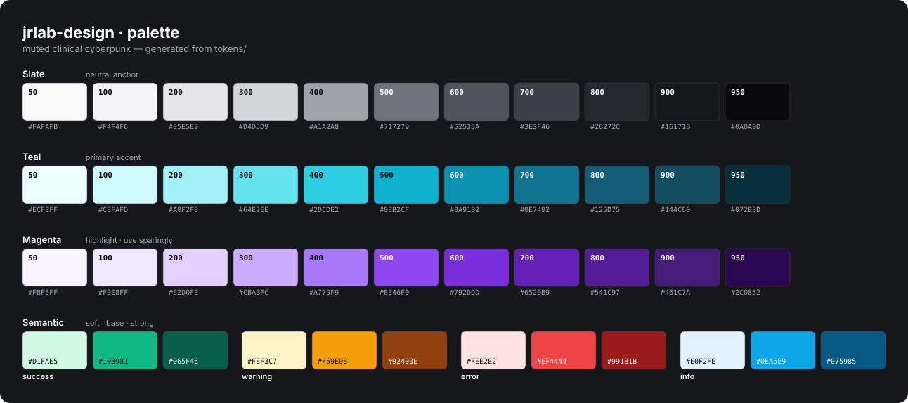

# jrlab design system

Clinical nouveau-cyberpunk component kit for analytics and case presentations.
A calm slate ground, a cyber-teal primary, and a single violet-neon note — tuned for dense data, vitals, and genomic case views in light and dark mode.

```
npm install jrlab-design
```

---

## Design language

> Numbers are the hero. The chrome stays quiet so the data can glow.

The system is built on three constraints: **two typefaces** (Inter for UI, JetBrains Mono for every number), **three hues** (slate anchor, teal accent, violet highlight), and **one neon note per surface** — never two glowing things competing.

---

## Color palette



<sub>Rendered from `tokens/` — regenerate with `npm run palette` after changing color tokens.</sub>

### Slate — neutral anchor

The ground for all surfaces, text, and chrome. Pulled toward cool gray with the blue cast removed.

| Token | Value | Role |
|---|---|---|
| `--color-slate-50` | `250 250 251` | Page background (light) |
| `--color-slate-100` | `244 244 246` | Surface-2, hover fills |
| `--color-slate-200` | `229 229 233` | Borders (light) |
| `--color-slate-500` | `113 114 121` | Muted text |
| `--color-slate-800` | `38 39 44` | Borders (dark) |
| `--color-slate-900` | `22 23 27` | Surface (dark) |
| `--color-slate-950` | `10 10 13` | Page background (dark) |

### Teal — primary accent

The action color. Blue-leaning cyber-teal used for buttons, focus rings, links, the live dot, and the signature glow.

```
 50 ░░░░░  236 254 255   very pale
100 ░░░░   206 250 253
200 ░░░    160 242 248
300 ░░     100 226 238
400 ░       45 205 226   interactive (dark mode)
500 ▓       14 178 207   ← ring, glow, live dot
600 ▓▓      10 145 178   ← button fill (light mode)
700 ▓▓▓     14 116 146   active/press
800 ████    18  93 117
950 █████    7  46  61   very dark
```

### Violet-magenta — highlight

One neon note per view. Harmonizes with the cyan-teal accent as a cool analogous pair. Use on a single spotlight surface — the copy-number amp bar, one glow ring, one badge.

```
 50 ░░░░░  248 245 255
300 ░░     203 171 252
400 ░       167 121 249  (dark mode alias)
500 ▓▓      142  70 240  ← highlight token
600 ▓▓▓     121  45 221
950 █████    44   8  82
```

### Semantic status

Four tiers, each with a base, soft background, and strong text token:

| Status | Base token | Usage |
|---|---|---|
| success | `--color-success` `16 185 129` | In range, confirmed, passing |
| warning | `--color-warning` `245 158 11` | Elevated, borderline, elevated TMB |
| error | `--color-error` `239 68 68` | Critical, driver alt, CN loss |
| info | `--color-info` `14 165 233` | Aneuploid, informational |

---

## Typography

Two typefaces. Absolutely no exceptions.

```
Inter          — all UI labels, body prose, nav, headings
JetBrains Mono — every number, vital, ID, code string, unit
```

**Type scale**

| Token | Size | Role |
|---|---|---|
| `--text-xs` | 12px | Labels, badges, overlines |
| `--text-sm` | 14px | UI default, body small |
| `--text-base` | 16px | Body |
| `--text-xl` | 20px | Card titles |
| `--text-2xl` | 24px | Section headings |
| `--text-3xl` | 30px | Metric readouts |
| `--text-4xl` | 36px | Page / hero title |

**Tracking rules:**
- Headings: `--tracking-tight` (`-0.02em`) — tight and confident
- Overlines / eyebrow labels: `--tracking-wide` (`0.08em`) + uppercase — `CASE · LIVE`, `TUMOR BURDEN`
- Body / UI: default (`0`)

**Numbers always use `font-variant-numeric: tabular-nums`** so columns align.

---

## Spacing & geometry

4px base grid. Surfaces are calm, never pill-y.

```
--space-1   4px    tight inline gaps
--space-2   8px    icon-to-label, badge padding
--space-3  12px    compact row gaps
--space-4  16px    card internal padding
--space-6  24px    section padding, nav horizontal
--space-8  32px    between cards
--space-10 40px    section vertical rhythm
```

**Corner radii:**
```
--radius-sm    4px   inputs, chips
--radius-md    8px   buttons
--radius-lg   12px   nested panels
--radius-xl   16px   cards                ← primary surface radius
--radius-full  ∞     dots, avatars, badges
```

**Shadows:** Soft and tight in light mode (`--shadow-sm/md/lg`). Dark mode adds optional **neon glow rings** — a 1px colored ring + a 22px outer bloom — to spotlight one surface at a time:

```css
--glow-accent:  0 0 0 1px rgb(var(--color-accent-500) / 0.35),
                0 0 22px -4px rgb(var(--color-accent-500) / 0.55);
--glow-magenta: 0 0 0 1px rgb(var(--color-magenta-500) / 0.35),
                0 0 22px -4px rgb(var(--color-magenta-500) / 0.55);
```

---

## Components

### Button

Four variants, three sizes. Inline-styled, token-driven, no Tailwind dependency.

```tsx
import { Button } from 'jrlab-design';

<Button>Confirm call</Button>
<Button variant="secondary">Open in gOS</Button>
<Button variant="ghost" size="sm">Filter</Button>
<Button variant="danger">Delete case</Button>
```

| Variant | Base fill | Hover | Active |
|---|---|---|---|
| `primary` | `accent-600` | `accent-500` | `accent-700` |
| `secondary` | `surface-2` | `slate-200/70%` | `slate-300/70%` |
| `ghost` | transparent | `surface-2` | `border` |
| `danger` | `error` | `error/90%` | `error/80%` |

Sizes: `sm` (32px), `md` (40px — default), `lg` (48px). Pass `as="a"` to render as a link.

---

### Badge

Semantic status pills. Soft translucent fill in dark mode (10–16% opacity), so they read without competing with the surface.

```tsx
import { Badge } from 'jrlab-design';

<Badge>Default</Badge>
<Badge variant="success" dot>In range</Badge>
<Badge variant="warning" dot>Elevated</Badge>
<Badge variant="error" dot>Driver</Badge>
<Badge variant="info" dot>Aneuploid</Badge>
```

The `dot` prop adds a 6px leading status dot in the variant color.

---

### Card

Surface container with optional `header` and `footer` slots, and a `glow` prop for the teal neon edge.

```tsx
import { Card } from 'jrlab-design';

<Card
  header={
    <>
      <Card.Title>Driver alterations</Card.Title>
      <Card.Description>5 of 1,204 events flagged for review</Card.Description>
    </>
  }
  footer={<Button size="sm">View all</Button>}
>
  {/* body content */}
</Card>

{/* Spotlight a single surface with glow */}
<Card glow header={<Card.Title>Copy-number profile</Card.Title>}>
  {/* CN visualization */}
</Card>
```

Structure: 16px radius, 1px hairline border, `rgb(var(--surface))` fill, `--shadow-sm`. The header and footer are divided by hairlines; the footer sits on a faintly tinted `surface-2` bar.

---

### Metric

The signature vitals readout — overline label, large mono value, optional unit, delta arrow, and status dot. This is the primary data primitive.

```tsx
import { Metric } from 'jrlab-design';

<Metric
  label="Cardiac output"
  value="4.9"
  unit="L/min"
  status="success"
  statusLabel="In range"
/>

<Metric
  label="TMB"
  value="11.4"
  unit="mut/Mb"
  delta={4}
  status="warning"
  statusLabel="Elevated"
/>

<Metric
  label="SV burden"
  value="218"
  unit="junctions"
  delta={-14}
  deltaSuffix="%"
  invertDelta  // decrease = good (green)
/>
```

Delta arrows: `↑` green / `↓` red by default; `invertDelta` flips the polarity. Status dot colors map to the semantic tokens.

---

### NavBar

Sticky top navigation with translucent backdrop blur. Includes the `useDarkMode()` hook for toggling `.dark` on `<html>`, persisted to `localStorage` under `"jrlab-theme"`.

```tsx
import { NavBar, useDarkMode } from 'jrlab-design';

// Uncontrolled — manages its own dark state
<NavBar
  links={[
    { label: 'Cases', href: '/cases' },
    { label: 'Simulator', href: '/sim' },
    { label: 'Academic', href: '/academic' },
  ]}
/>

// Controlled dark mode
const { dark, toggle } = useDarkMode();
<NavBar dark={dark} onToggleTheme={toggle} />
```

The logo defaults to the jrlab typographic wordmark (`jr` + `lab` in teal). Pass a `logo` prop to override. The bar is `surface/80%` with `saturate(180%) blur(8px)` so content scrolls underneath.

---

## CSS tokens

Link `styles.css` once and every token is available:

```html
<link rel="stylesheet" href="node_modules/jrlab-design/styles.css" />
```

Or import in a bundler:

```js
import 'jrlab-design/styles.css';
```

All color tokens are stored as raw RGB channels so opacity compositing works everywhere:

```css
/* This pattern works for any token */
background: rgb(var(--color-accent-500) / 0.15);
border-color: rgb(var(--border));
color: rgb(var(--fg-muted));
```

**Portable semantic aliases** flip automatically under `.dark` on `<html>`:

| Token | Light | Dark |
|---|---|---|
| `--bg` | `slate-50` | `slate-950` |
| `--surface` | `#fff` | `slate-900` |
| `--surface-2` | `slate-100` | `slate-800` |
| `--border` | `slate-200` | `slate-800` |
| `--fg` | `slate-900` | `slate-100` |
| `--fg-muted` | `slate-500` | `slate-400` |
| `--accent` | `accent-600` | `accent-400` |
| `--highlight` | `magenta-500` | `magenta-400` |

---

## Dark mode

Toggle by adding/removing the `.dark` class on `<html>`. The `useDarkMode()` hook handles this and persists the preference:

```tsx
import { useDarkMode } from 'jrlab-design';

function App() {
  const { dark, toggle } = useDarkMode();
  // dark is synced to <html class="dark"> and localStorage
}
```

To restore the saved preference before first paint (prevents flash):

```html
<script>
  try {
    if (localStorage.getItem('jrlab-theme') === 'dark')
      document.documentElement.classList.add('dark');
  } catch (e) {}
</script>
```

---

## The cyber-grid hero

The signature background for case headers and hero sections: `slate-950` ground with two radial glows at 12–16% opacity.

```css
background-color: rgb(var(--color-slate-950));
background-image:
  radial-gradient(40rem 22rem at 8% -40%,
    rgb(var(--color-accent-500) / 0.16), transparent 60%),
  radial-gradient(34rem 20rem at 98% -30%,
    rgb(var(--color-magenta-500) / 0.12), transparent 60%);
```

Teal blooms top-left, violet blooms top-right. No photography, no illustration, no repeating patterns — just light on dark.

---

## Motion

Restrained. All interactive elements transition at `150ms ease` on `color`, `background-color`, and `box-shadow`. No bounces, no parallax, no infinite loops. Entrances are short fades when used at all. Respects `prefers-reduced-motion`.

- **Hover:** background lightens or tints one step; never a scale-up
- **Press / active:** color darkens one step; no shrink or transform

---

## Iconography

Outline icons, 2px stroke, round caps — the [Lucide](https://lucide.dev) set (the faithful Feather continuation). Inline `<svg>` with `stroke="currentColor"` so icons inherit text color and adapt to dark mode automatically.

- 16px in dense UI and buttons
- 18–20px in nav and headers
- No icon font, no PNG, no emoji as decoration

The brand mark is a **typographic wordmark** only: `jr` in foreground + `lab` in `accent-500`. Never an image.

---

## Content voice

Clinical, calm, confident. Short declaratives. No hype.

- **Person:** system-voice by default ("Within range", "Trending down"). Address the user as *you* in instructions, never "we".
- **Casing:** brand + product labels lowercase (`jrlab`, `jrlab/sim`). UI labels sentence case. Overlines UPPERCASE with wide tracking.
- **Units:** always mono — `4.9 L/min`, `62 mmHg`, `312 Mb`. Standard medical abbreviations (MAP, SpO₂, TMB, SV).
- **Status:** bounded — "Within range" · "Borderline" · "Critical" · "Pending" · "Trending down"
- **Don't:** marketing adjectives, emoji, ALL-CAPS sentences, multiple accent colors competing.

---

## Repo layout

```
jrlab-design/
├── styles.css              CSS entry — link this one file
├── tokens/
│   ├── colors.css          Slate / teal / magenta ramps (raw RGB channels)
│   ├── semantic.css        Status colors + surface aliases (light & dark)
│   ├── typography.css      Families, scale, weights, tracking
│   ├── spacing.css         4px grid, radii, shadows, glow rings, layout max-widths
│   ├── fonts.css           Google Fonts import (Inter + JetBrains Mono)
│   └── base.css            Minimal reset + body defaults
├── src/
│   ├── index.ts            Barrel export
│   └── components/
│       ├── Button.tsx
│       ├── Badge.tsx
│       ├── Card.tsx
│       ├── Metric.tsx
│       └── NavBar.tsx
└── dist/                   Built output (ESM + CJS + .d.ts)
```

---

*jrlab · [jrlab.org](https://jrlab.org)*
